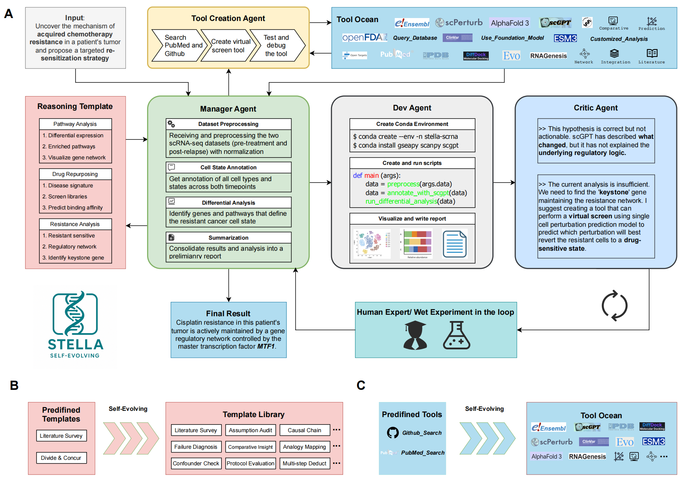
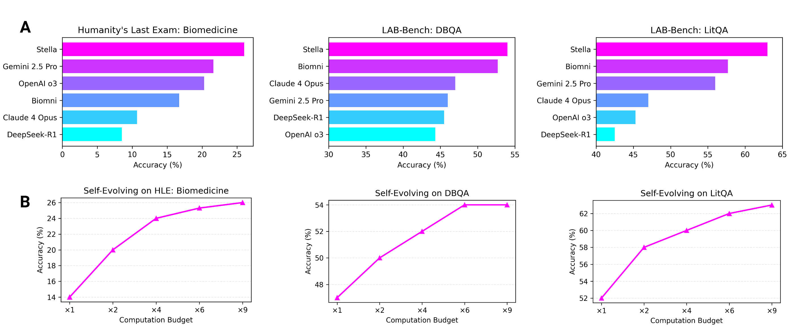

# STELLA: Self-Evolving LLM Agent for Biomedical Research

This repository contains the official implementation of the paper **STELLA: Self-Evolving LLM Agent for Biomedical Research**.

[**Paper on arXiv**](https://arxiv.org/abs/2507.02004) | [**Mention on 𝕏 (Twitter)**](https://x.com/BiologyAIDaily/status/1941122955850993966)

---

## Abstract

Recent advancements in Large Language Models (LLMs) have demonstrated their potential in specialized fields such as biomedical research. However, their performance is often limited by the lack of domain-specific knowledge and reasoning abilities. To address this, we introduce STELLA, a Self-Evolving LLM Agent designed for complex biomedical research tasks. STELLA leverages a novel self-evolving mechanism that enables it to continuously learn and adapt from new data and experiences. Our agent architecture integrates a dynamic knowledge base, a reasoning module, and a self-correction component, allowing it to perform intricate tasks such as literature analysis, experimental design, and data interpretation. We evaluate STELLA on a comprehensive benchmark of biomedical question-answering and research simulation tasks, demonstrating its superior performance over existing state-of-the-art models. Our results highlight the potential of self-evolving agents to accelerate biomedical discovery and innovation.

## Key Figures



*Figure 1: Overview of the STELLA framework. The framework consists of four main components: a reasoning template, a manager agent, a dev agent, and a critic agent. The tool ocean provides a set of predefined and self-evolving tools for the agents to use.*

<br>



*Figure 2: Performance of STELLA on various benchmarks. (A) Comparison of STELLA with other LLMs on Humanity's Last Exam (HLE) Biomedicine, LAB-Bench (DBQA), and LAB-Bench (LitQA). (B) Self-evolving performance of STELLA on the same benchmarks with increasing computation budget.*

## Updates & Collaboration

* **Wet-Lab Verification**: We are currently in the process of conducting wet-lab experiments to verify the key findings and predictions generated by STELLA.
* **Call for Collaboration**: We welcome wet-lab collaborations, including but not limited to target discovery, antibody/protein/RNA optimization, etc. Please reach out to zz8680@princeton.edu
* **Full Release**: The complete, full-version preprint and the final source code will be released soon. Stay tuned for updates!

## Citation

If you find our work useful, please consider citing our paper:

```bibtex
@article{jin2025stella,
  title={STELLA: Self-Evolving LLM Agent for Biomedical Research},
  author={Jin, Ruofan and Zhang, Zaixi and Wang, Mengdi and Cong, Le},
  journal={arXiv preprint arXiv:2507.02004},
  year={2025}
}
