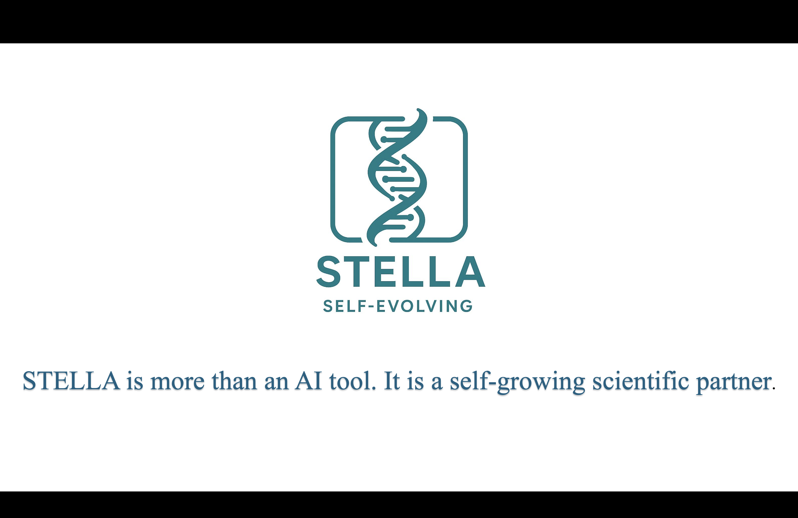

# STELLA: Self-Evolving LLM Agent for Biomedical Research

This repository contains the official implementation of the paper **STELLA: Self-Evolving LLM Agent for Biomedical Research**.

[**Paper on arXiv**](https://arxiv.org/abs/2507.02004) | [**Mention on 𝕏 (Twitter)**](https://x.com/BiologyAIDaily/status/1941122955850993966)

---

## Abstract

Recent advancements in Large Language Models (LLMs) have demonstrated their potential in specialized fields such as biomedical research. However, their performance is often limited by the lack of domain-specific knowledge and reasoning abilities. To address this, we introduce STELLA, a Self-Evolving LLM Agent designed for complex biomedical research tasks. STELLA leverages a novel self-evolving mechanism that enables it to continuously learn and adapt from new data and experiences. Our agent architecture integrates a dynamic knowledge base, a reasoning module, and a self-correction component, allowing it to perform intricate tasks such as literature analysis, experimental design, and data interpretation. We evaluate STELLA on a comprehensive benchmark of biomedical question-answering and research simulation tasks, demonstrating its superior performance over existing state-of-the-art models. Our results highlight the potential of self-evolving agents to accelerate biomedical discovery and innovation.

## 🎬 Demo Video

[](https://drive.google.com/file/d/1a6PoJWZMMix8zyccWVOZxU47NKhABO_W/view?usp=sharing)

*Click the thumbnail above to watch the STELLA demonstration video on Google Drive.*

## Key Figures


*Figure 1: Overview of the STELLA framework. The framework consists of four main components: a reasoning template, a manager agent, a dev agent, and a critic agent. The tool ocean provides a set of predefined and self-evolving tools for the agents to use.*

<br>


*Figure 2: Performance of STELLA on various benchmarks. (A) Comparison of STELLA with other LLMs on Humanity's Last Exam (HLE) Biomedicine, LAB-Bench (DBQA), and LAB-Bench (LitQA). (B) Self-evolving performance of STELLA on the same benchmarks with increasing computation budget.*

## Project Structure

```
STELLA/
├── 📄 README.md                    # This documentation
├── 🚀 stella_core.py               # Core multi-agent system
├── 🚀 start_stella_web.py          # Web interface launcher
├── 🎨 stella_ui_english.py         # Web UI implementation
├── 💾 memory_manager.py            # Memory management system
├── 📚 Knowledge_base.py            # Knowledge base system
├── 🛠️ predefined_tools.py          # Core system tools
│
├── 📁 new_tools/                   # Professional tool library
│   ├── 📚 literature_tools.py      # Literature search tools
│   ├── 🧬 database_tools.py        # Biomedical databases
│   ├── 💊 virtual_screening_tools.py # Drug discovery tools
│   ├── 🧪 enzyme_tools.py          # Biochemical analysis
│   ├── 🤖 llm.py                   # LLM integration utilities
│   └── 🛡️ biosecurity_tool.py      # Safety mechanisms
│
├── 📁 asset/                       # Images and figures
│   ├── 🌟 stella_logo.png          # STELLA logo
│   ├── 📊 stella_illustration.png   # Framework diagram
│   └── 📈 Stella_result.png        # Performance results
│
└── 📁 prompts/                     # Prompt templates
```

## Usage

### Quick Start

**Simple mode (basic functionality):**
```bash
python stella_core.py
```

**Memory-enhanced mode (recommended):**
```bash
python stella_core.py --use_template --use_mem0
```

**Web interface (user-friendly):**
```bash
python start_stella_web.py
```

### Usage Options

- **Basic Mode**: Core STELLA functionality with standard agents
- **Memory Enhanced**: Adds template learning and enhanced memory capabilities using Mem0
- **Web Interface**: Provides a user-friendly Gradio interface for interaction

## Installation

### Option 1: Using Conda (Recommended)
```bash
# Clone the repository
git clone https://github.com/yourusername/STELLA.git
cd STELLA

# Create conda environment with Python 3.12
conda create -n stella python=3.12 -y
conda activate stella

# Install scientific packages via conda
conda install -c conda-forge numpy pandas scikit-learn matplotlib seaborn -y

# Install remaining dependencies via pip
pip install -r requirements.txt
```

### Option 2: Using pip only
```bash
# Python 3.8+ required
python --version

# Core dependencies
pip install gradio>=4.0.0
pip install 'smolagents[mcp]'
pip install numpy pandas scikit-learn
pip install requests beautifulsoup4 markdownify
```


#### Optional Enhanced Features
```bash
# For Mem0 enhanced memory (recommended)
pip install mem0ai

# For biomedical analysis
pip install biopython rdkit-pypi
pip install pymed arxiv scholarly

# For MCP tools integration
pip install uvx
```

### API Keys Configuration

Create a `.env` file in your local environment with the following API keys:

```bash
# Create .env file
touch .env

# Add the following API keys to .env file:
echo "OPENROUTER_API_KEY=your_openrouter_api_key_here" >> .env
echo "SERPAPI_API_KEY=your_serpapi_key_here" >> .env
echo "PAPERQA_API_KEY=your_paperqa_key_here" >> .env
```

**Required API Keys:**
- **OpenRouter API**: For LLM model access and routing
- **SERPAPI**: For enhanced web search capabilities
- **PaperQA API**: For academic literature analysis

**Get API Keys:**
- OpenRouter: https://openrouter.ai/
- SERPAPI: https://serpapi.com/
- PaperQA: https://paperqa.ai/

## Resource Download & Setup

**Large Resource Files**: Due to the size of biomedical datasets, additional resources are available for download:

### Download Resources
```bash
# Download the resource package (optional for basic usage)
# Manual download from: https://drive.google.com/file/d/1n8I-gkM58wL1OZysdpYhr-Q9ZApd9yU4/view?usp=sharing
# File: resource_backup_20250719_055729.zip (2.0GB compressed)
```

### Extract Resources
```bash
# Create resource directory
mkdir -p resource/

# Extract downloaded resources (if downloaded)
unzip resource_backup_20250719_055729.zip -d resource/

# Verify extraction
ls resource/
```

**Note**: Resources are optional for basic STELLA functionality but enhance performance for complex biomedical tasks.


## Updates & Collaboration

* **Wet-Lab Verification**: We are currently in the process of conducting wet-lab experiments to verify the key findings and predictions generated by STELLA.
* **Call for Collaboration**: We welcome both wet-lab collaborations (target discovery, antibody/protein/RNA optimization, etc.) and community contributions including: 🔧 New tools & algorithms 📊 Datasets & knowledge bases 💻 Software integration 📋 Benchmarks & metrics 📚 Tutorials & use cases. Please reach out to zz8680@princeton.edu or submit pull requests!
* **Full Release**: The complete, full-version preprint and the final source code will be released soon. Stay tuned for updates!

## Citation

If you find our work useful, please consider citing our paper:

```bibtex
@article{jin2025stella,
  title={STELLA: Self-Evolving LLM Agent for Biomedical Research},
  author={Jin, Ruofan and Zhang, Zaixi and Wang, Mengdi and Cong, Le},
  journal={arXiv preprint arXiv:2507.02004},
  year={2025}
}
```
