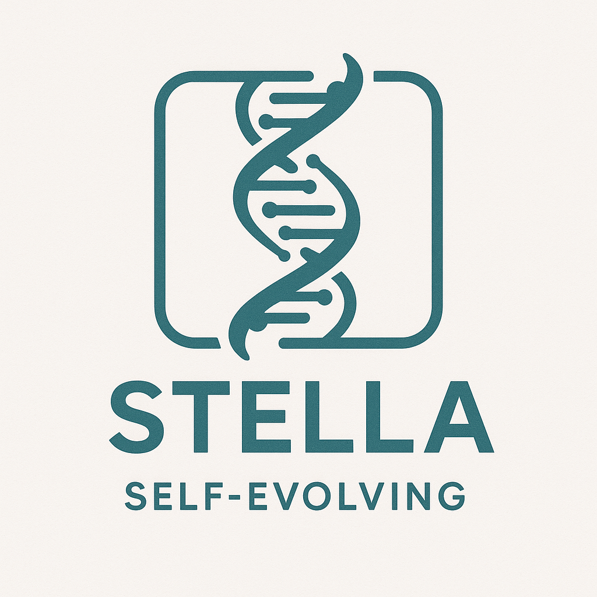

# 🌟 STELLA: Self-Evolving Intelligent Laboratory Assistant

<div align="center">



**Advanced Multi-Agent AI Research Assistant for Biomedical Science**


[🇺🇸 English](#english-documentation) | [🇨🇳 中文文档](#中文文档)

</div>

---

## 🚀 Quick Start

### Simple Launch (Recommended)
```bash
# Start STELLA with enhanced features
python3 start_stella_web.py
```

### Access STELLA
- **Local**: http://localhost:7860
- **Network**: http://[your-ip]:7860  
- **Public**: Gradio sharing link (auto-generated)

---

## 📖 English Documentation

### 🌟 Overview

**STELLA** (Self-Evolving Intelligent Laboratory Assistant) is a revolutionary multi-agent AI framework designed specifically for biomedical research and scientific discovery. STELLA combines intelligent tool selection, dynamic tool creation, advanced memory management, and multi-agent collaboration to provide unparalleled research assistance.

### ✨ Core Features

#### 🤖 **LLM-Driven Intelligent Tool Selection**
- **Smart Analysis**: Uses Gemini-2.5-Pro for deep understanding of research queries
- **Dynamic Loading**: Automatically selects and loads the most relevant tools from **61+ professional biomedical tools**
- **Multi-language**: Perfect support for English and Chinese scientific literature
- **Real-time Optimization**: Continuously improves tool selection based on usage patterns

#### 🧠 **Self-Evolution Capabilities**
- **Quality Assessment**: Automatic evaluation of task completion quality using critic agent
- **Dynamic Tool Creation**: Generates specialized tools when existing ones are insufficient
- **Continuous Learning**: Learns from successful approaches and improves over time
- **Performance Optimization**: System-wide optimization based on usage analytics

#### 💾 **Advanced Memory System**
- **Mem0 Enhanced**: Semantic memory search and intelligent knowledge management
- **Knowledge Templates**: Save and retrieve successful problem-solving patterns
- **Collaborative Memory**: Shared memory spaces for multi-agent collaboration
- **User Personalization**: Individual memory profiles and preference learning

#### 🤝 **Multi-Agent Architecture**
- **Manager Agent**: Strategic coordinator with full system permissions (Gemini-2.5-Pro)
- **Dev Agent**: Development and execution specialist (Claude Sonnet-4)
- **Critic Agent**: Quality evaluation and improvement recommendations (Gemini-2.5-Pro)
- **Tool Creation Agent**: Dynamic tool development specialist (Claude Sonnet-4)

### 🛠️ Professional Tool Library (61+ Tools)

#### 📚 **Literature & Search Tools**
- **PubMed**: Advanced medical literature search and analysis
- **ArXiv**: Academic paper discovery and content extraction
- **Google Scholar**: Citation analysis and research trends
- **PDF Extraction**: Intelligent document processing and analysis
- **Web Search**: Enhanced scientific web search capabilities

#### 🧬 **Database Tools**
- **UniProt**: Protein sequence and annotation data
- **PDB**: Protein structure analysis and visualization
- **KEGG**: Pathway analysis and metabolic networks
- **Ensembl**: Genomic data access and gene annotation
- **STRING**: Protein-protein interaction networks
- **ChEMBL**: Chemical bioactivity database access
- **TCGA**: Cancer genomics data analysis
- **GTEx**: Gene expression tissue atlas

#### 💊 **Virtual Screening & Drug Discovery**
- **Molecular Descriptors**: Chemical property calculation
- **ADMET Prediction**: Drug-like property assessment
- **Molecular Docking**: Protein-ligand interaction modeling
- **Pharmacophore**: Drug design pattern analysis
- **Toxicity Prediction**: Safety assessment tools

#### 🧪 **Specialized Analysis**
- **Enzyme Function**: Biochemical pathway analysis
- **Protein Folding**: Structure prediction and analysis
- **Gene Expression**: RNA-seq and microarray analysis
- **Clinical Trials**: Medical research database access
- **Biosafety**: Research ethics and safety guidelines

### 🏗️ System Architecture

```
STELLA Framework
├── 🧠 Manager Agent (Gemini-2.5-Pro)
│   ├── 🎯 analyze_query_and_load_relevant_tools()
│   ├── 📋 Task coordination and delegation
│   ├── 🔧 Complete tool management authority
│   └── 📚 Memory and knowledge base control
│
├── 🛠️ Dev Agent (Claude Sonnet-4)
│   ├── 💻 Code execution and environment management
│   ├── 🐍 Python script generation and testing
│   ├── 📦 Package installation and dependency management
│   └── 🔧 Basic tool discovery and loading
│
├── 🎯 Critic Agent (Gemini-2.5-Pro)
│   ├── 📊 Task completion quality evaluation
│   ├── 🔍 Gap analysis and improvement recommendations
│   ├── 🛠️ Tool creation necessity assessment
│   └── 📈 Performance optimization suggestions
│
└── 🧰 Tool Creation Agent (Claude Sonnet-4)
    ├── 🛠️ Dynamic tool development and testing
    ├── 📚 Best practice research and implementation
    ├── 🔧 Tool integration and deployment
    └── 📖 Documentation and quality assurance
```

### 📂 Project Structure

```
STELLA/
├── 📄 README.md                           # This documentation
├── 🚀 start_stella_web.py                 # Web launcher (recommended)
├── 🚀 start_stella_basic.py               # Basic launcher
├── 🧠 stella_core.py                      # Core multi-agent system
├── 💾 memory_manager.py                   # Advanced memory management
├── 📚 Knowledge_base.py                   # Knowledge base system
├── 🎨 stella_ui_english.py                # English web interface
├── 🛠️ predefined_tools.py                 # Core system tools
├── 📊 STELLA_Framework_Introduction_EN.md  # Detailed documentation
├── 📊 STELLA_Framework_Introduction_CN.md  # Chinese documentation
├── 🧪 segmented_test_suite.py             # Comprehensive test suite
│
├── 📁 new_tools/                          # Professional tool library
│   ├── 📚 literature_tools.py             # Literature search tools
│   ├── 🧬 database_tools.py               # Biomedical databases
│   ├── 💊 virtual_screening_tools.py      # Drug discovery tools
│   ├── 🧪 enzyme_tools.py                 # Biochemical analysis
│   ├── 🤖 llm.py                          # LLM integration utilities
│   └── 🛡️ biosecurity_alignment_guard.py  # Safety mechanisms
│
├── 📁 resource/                           # Data resources (9.7GB)
│   ├── 🧬 OmicsExpressionProteinCodingGenesTPMLogp1_transposed.csv
│   ├── 🔬 transposed_crispr_gene_effects.csv
│   ├── 📊 human_COXPRES_db_v8.1/          # Coexpression database
│   ├── 🗃️ Expression_Atlas/               # Gene expression data
│   └── 📈 Various biomedical datasets
│
└── 🗜️ resource_backup_20250719_055729.zip # Compressed resources (2.0GB)
```

### 💿 Resource Download

**Large Resource Files**: Due to the size of biomedical datasets (9.7GB), the resource folder has been compressed and made available via Google Drive:

📥 **Download**: [STELLA Resources from Google Drive](https://drive.google.com/file/d/1n8I-gkM58wL1OZysdpYhr-Q9ZApd9yU4/view?usp=sharing)
- **File**: `resource_backup_20250719_055729.zip` (2.0GB compressed)  
- **Contents**: Biomedical databases, gene expression datasets, protein networks
- **Extract to**: `agents/STELLA/resource/`

### 🛠️ Installation

#### Prerequisites
```bash
# Python 3.8+ required
python --version

# Core dependencies
pip install gradio>=4.0.0
pip install 'smolagents[mcp]'
pip install numpy pandas scikit-learn
pip install requests beautifulsoup4 markdownify
```

#### Optional Enhanced Features
```bash
# For Mem0 enhanced memory (recommended)
pip install mem0ai

# For biomedical analysis
pip install biopython rdkit-pypi
pip install pymed arxiv scholarly

# For MCP tools integration
pip install uvx
```

#### Setup
```bash
# Clone or download STELLA
cd agents/STELLA/

# Download and extract resources (optional for basic usage)
# Extract resource_backup_20250719_055729.zip to ./resource/

# Start STELLA
python3 start_stella_web.py
```

### 🚀 Usage Guide

#### **Starting STELLA**

##### 1. **Enhanced Mode (Recommended)**
```bash
python3 start_stella_web.py
# Features: Template learning + Mem0 memory + Full tool access
```

##### 2. **Core System Mode**
```bash
python3 stella_core.py --use_template --use_mem0
# Advanced: Direct core system access with all features
```

##### 3. **Basic Mode**
```bash
python3 start_stella_basic.py
# Minimal: Basic functionality without enhanced features
```

#### **Command Line Options**
```bash
# Enable knowledge base templates
python3 stella_core.py --use_template

# Enable Mem0 enhanced memory
python3 stella_core.py --use_template --use_mem0

# Use Mem0 managed platform
python3 stella_core.py --use_template --use_mem0 --mem0_platform --mem0_api_key YOUR_KEY

# Custom port
python3 stella_core.py --port 8080
```

### 📝 Example Use Cases

#### 🔬 **Biomedical Research**
```
Analyze the latest CRISPR-Cas9 developments in cancer therapy from PubMed and Nature papers published in 2024
```

#### 🧬 **Protein Analysis**
```
Retrieve the crystal structure of human insulin from PDB, analyze its binding sites, and predict potential drug interactions
```

#### 💊 **Drug Discovery**
```
Screen potential inhibitors for EGFR kinase using virtual docking and predict their ADMET properties
```

#### 📊 **Data Analysis**
```
Create a machine learning pipeline to classify protein functions using sequence embeddings and expression data
```

#### 📚 **Literature Review**
```
Conduct a comprehensive analysis of single-cell RNA sequencing methods published in the last 2 years
```

#### 🧮 **Computational Biology**
```
Analyze gene coexpression networks in cancer datasets and identify potential biomarkers
```

### 🎯 Intelligent Workflow

STELLA follows an optimized workflow for maximum efficiency:

1. **🎯 Query Analysis**: Manager agent analyzes user request using Gemini-2.5-Pro
2. **🛠️ Tool Selection**: `analyze_query_and_load_relevant_tools()` automatically loads relevant professional tools
3. **📋 Task Delegation**: Manager coordinates with specialized agents for execution
4. **🔍 Quality Evaluation**: Critic agent assesses completion quality and suggests improvements
5. **🧠 Self-Evolution**: System creates new tools if needed and learns from successful approaches
6. **💾 Memory Storage**: Successful patterns saved for future similar tasks

### 🔧 Advanced Features

#### **Multi-Agent Collaboration**
- **Shared Workspaces**: `create_shared_workspace()` for team projects
- **Task Breakdown**: `create_task_breakdown()` for complex multi-step research
- **Progress Tracking**: `get_task_progress()` for project monitoring
- **Knowledge Sharing**: `share_agent_discovery()` for cross-team learning

#### **Self-Evolution**
- **Dynamic Tool Registry**: Real-time tool creation and management
- **Quality Assessment**: Automated evaluation with improvement recommendations
- **Performance Analytics**: Usage patterns and optimization insights
- **Continuous Learning**: Knowledge base expansion from successful approaches

#### **Memory Management**
- **Template Learning**: Save successful problem-solving approaches
- **Semantic Search**: Intelligent retrieval of relevant past experiences
- **User Personalization**: Individual memory profiles and preferences
- **Collaborative Memory**: Shared knowledge spaces for team research

### 🛡️ Safety & Security

- **Biosafety Alignment**: Built-in research ethics and safety guidelines
- **Secure Execution**: Sandboxed environment for code execution
- **Input Validation**: Comprehensive sanitization of user inputs
- **Output Filtering**: Safety checks for generated content

### 📊 Performance & Monitoring

- **Real-time Tracking**: Step-by-step execution monitoring
- **Token Usage**: Detailed API usage analytics
- **Performance Metrics**: Response time and accuracy measurements
- **Error Handling**: Comprehensive error recovery and debugging

### 🤝 Contributing

STELLA is designed for extensibility. Contribute by:
- Adding new biomedical tools to `new_tools/`
- Improving agent capabilities in `stella_core.py`
- Enhancing memory systems in `memory_manager.py`
- Expanding knowledge templates

### 📄 License

MIT License - see LICENSE file for details.

---

## 🇨🇳 中文文档

### 🌟 概述

**STELLA**（自进化智能实验室助手）是专为生物医学研究和科学发现设计的革命性多智能体AI框架。STELLA结合了智能工具选择、动态工具创建、高级记忆管理和多智能体协作，提供无与伦比的研究助力。

### ✨ 核心特性

#### 🤖 **LLM驱动的智能工具选择**
- **智能分析**: 使用Gemini-2.5-Pro深度理解研究查询
- **动态加载**: 自动从**61+专业生物医学工具**中选择最相关的工具
- **多语言支持**: 完美支持中英文科学文献
- **实时优化**: 基于使用模式持续改进工具选择

#### 🧠 **自我进化能力**
- **质量评估**: 使用评价智能体自动评估任务完成质量
- **动态工具创建**: 当现有工具不足时生成专用工具
- **持续学习**: 从成功方法中学习并持续改进
- **性能优化**: 基于使用分析进行系统级优化

#### 💾 **高级记忆系统**
- **Mem0增强**: 语义记忆搜索和智能知识管理
- **知识模板**: 保存和检索成功的问题解决模式
- **协作记忆**: 多智能体协作的共享记忆空间
- **用户个性化**: 个人记忆档案和偏好学习

### 🚀 快速开始

#### **启动STELLA**
```bash
# 推荐：启动增强版STELLA
python3 start_stella_web.py

# 访问地址
# 本地: http://localhost:7860
# 网络: http://[你的IP]:7860
```

#### **示例研究任务**
```
从PubMed搜索2024年发表的CRISPR-Cas9在癌症治疗中的最新研究进展
```

```
从PDB获取人胰岛素的晶体结构，分析其结合位点，并预测潜在的药物相互作用
```

```
使用虚拟对接筛选EGFR激酶的潜在抑制剂，并预测其ADMET性质
```

### 📁 项目结构

```
STELLA/
├── 🚀 start_stella_web.py      # Web启动器（推荐）
├── 🧠 stella_core.py           # 核心多智能体系统
├── 💾 memory_manager.py        # 高级记忆管理
├── 📚 Knowledge_base.py        # 知识库系统
├── 📁 new_tools/              # 专业工具库（61+工具）
├── 📁 resource/               # 数据资源（9.7GB）
└── 🗜️ resource_backup_*.zip   # 压缩资源（2.0GB）
```

### 💿 资源下载

**大型资源文件**: 由于生物医学数据集较大（9.7GB），资源文件夹已压缩并通过Google Drive提供：

📥 **下载**: [STELLA资源Google Drive链接](https://drive.google.com/file/d/1n8I-gkM58wL1OZysdpYhr-Q9ZApd9yU4/view?usp=sharing)
- **文件**: `resource_backup_20250719_055729.zip` (压缩后2.0GB)
- **内容**: 生物医学数据库、基因表达数据集、蛋白质网络
- **解压到**: `agents/STELLA/resource/`

### 🛠️ 安装说明

```bash
# 基础依赖
pip install gradio 'smolagents[mcp]' numpy pandas scikit-learn

# Mem0增强记忆（推荐）
pip install mem0ai

# 生物医学分析工具
pip install biopython rdkit-pypi pymed arxiv scholarly
```

### 🎯 工作流程

1. **🎯 查询分析**: Manager智能体使用Gemini-2.5-Pro分析用户请求
2. **🛠️ 工具选择**: 自动加载最相关的专业工具
3. **📋 任务委派**: Manager协调专业智能体执行任务
4. **🔍 质量评估**: Critic智能体评估完成质量并提出改进建议
5. **🧠 自我进化**: 系统根据需要创建新工具并从成功经验中学习
6. **💾 记忆存储**: 将成功模式保存供未来类似任务使用

---

<div align="center">

**🌟 开始您的科学发现之旅！** 

Made with ❤️ for the Scientific Community

</div> 