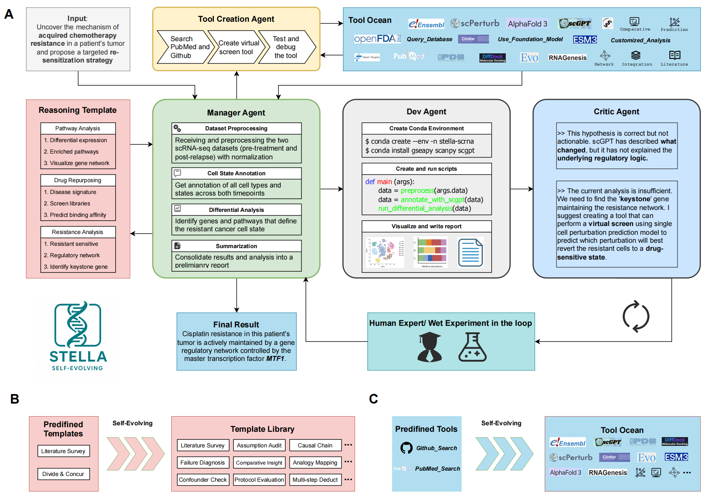
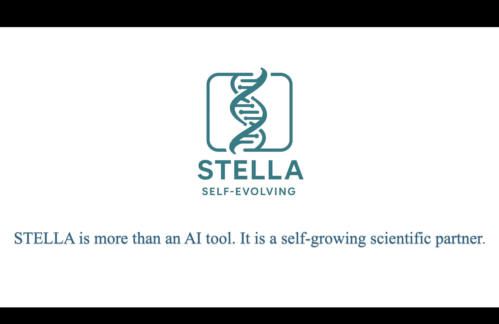
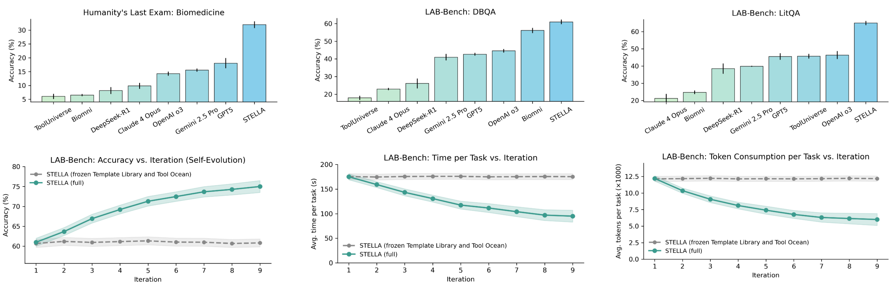

<div align="center">


# STELLA

### Self-Evolving Multimodal Agents for Biomedical Research

[](https://github.com/zaixizhang/STELLA)
[](LICENSE)
[](https://www.biorxiv.org/content/10.1101/2025.07.01.662467v2)
[](https://arxiv.org/abs/2507.02004)
[](https://stella-agent.com/)

[**Paper**](https://www.biorxiv.org/content/10.1101/2025.07.01.662467v2) | [**Online Demo**](https://stella-agent.com/) | [**arXiv**](https://arxiv.org/abs/2507.02004) | [**Twitter**](https://x.com/BiologyAIDaily/status/1941122955850993966)

### :rocket: [Try STELLA Online — No Installation, No API Keys, One Click to Start!](https://stella-agent.com/)
**[:globe_with_meridians: stella-agent.com](https://stella-agent.com/)**

**Authors:**
Ruofan Jin<sup>1</sup>, Mingyang Xu<sup>2</sup>, Fei Meng<sup>3,4</sup>, Guancheng Wan<sup>5</sup>, Qingran Cai<sup>6</sup>, Yize Jiang<sup>7</sup>, Jin Han<sup>8</sup>, Yuanyuan Chen<sup>9</sup>, Wanqing Lu<sup>9</sup>, Mengyang Wang<sup>10</sup>, Zhiqian Lan<sup>11</sup>, Yuxuan Jiang<sup>11</sup>, Junhong Liu<sup>7,✉</sup>, Dongyao Wang<sup>3,4,✉</sup>, Le Cong<sup>12,✉</sup>, and Zaixi Zhang<sup>1,✉</sup>

<sup>1</sup>Princeton University, <sup>2</sup>University of Michigan, <sup>3</sup>The First Affiliated Hospital, USTC, <sup>4</sup>National Key Laboratory of Immune Response and Immunotherapy
<sup>5</sup>UCLA, <sup>6</sup>Shanghai Jiao Tong University, <sup>7</sup>Microcyto, <sup>8</sup>Nanjing University, <sup>9</sup>Tianjin University of Science and Technology
<sup>10</sup>Peking University, <sup>11</sup>The University of Hong Kong, <sup>12</sup>Stanford University
<sup>✉</sup> liujunhong@microcyto.cn, dywsn@ustc.edu.cn, congle@stanford.edu, zz8680@princeton.edu

</div>

---

## Contents

- [Overview](#overview)
- [Demo Video](#demo-video)
- [Key Results](#key-results)
- [Quick Start](#quick-start)
- [Installation](#installation)
- [Resource Download](#resource-download--setup)
- [API Keys](#api-keys)
- [Tool Creation Benchmark](#tool-creation-benchmark)
- [Case Studies & Reproducibility](#case-studies--reproducibility)
- [Citation](#citation)
- [Related Projects](#related-projects)
- [License](#license)

## Overview



*Overview of the STELLA framework. The framework consists of four main components: a manager agent, a dev agent, a critic agent, and a tool ocean. The template system provides structured workflows learned from successful runs.*

| Component | Description |
|-----------|-------------|
| **Manager Agent** | Decomposes scientific objectives, retrieves relevant templates, orchestrates sub-agents |
| **Dev Agent** | Executes bioinformatics analyses, runs code, queries databases and literature |
| **Critic Agent** | Evaluates result quality, identifies gaps, recommends improvements |
| **Tool Creation Agent** | Dynamically creates new tools when existing ones are insufficient |
| **Tool Ocean** | 60+ predefined and self-evolving tools for literature search, databases, virtual screening |
| **Template System** | Retrieves, applies, and auto-creates structured workflow skills from successful runs |

Models are configurable via [OpenRouter](https://openrouter.ai/). Edit model variables in `stella_core.py` to switch between GPT, Claude, Gemini, and other providers.


**Try STELLA online at [stella-agent.com](https://stella-agent.com/) — no installation required.**


## Demo Video

[](https://drive.google.com/file/d/1a6PoJWZMMix8zyccWVOZxU47NKhABO_W/view?usp=sharing)

*Click the thumbnail above to watch the STELLA demonstration video on Google Drive.*

## Key Results



Key achievements:
- Best performance on built tool creation benchmark and public benchmark (LabBench, HLE)
- Identified **BTN3A1** as a novel regulator in acute myeloid leukemia, verified through CRISPR studies across 4 cell lines
- Developed enzyme variants showing **>2x improvement** in catalytic activity
- Robotic laboratory automation with success rates improving from **17% to 82%**


## Quick Start

**Option 1: Use the online version (recommended)**

Visit [stella-agent.com](https://stella-agent.com/) to use STELLA directly in your browser.

**Option 2: Docker image**

A pre-built Docker image package (including ablation variants) is available on [Google Drive](https://drive.google.com/file/d/1iN9AOJpi0FBDz7i_gjmW8EbcjTY0z8bF/view). See [`docker/README.md`](docker/README.md) for download and usage instructions.

**Option 3: Run locally (from source)**

```bash
# Clone and install
git clone https://github.com/zaixizhang/STELLA.git
cd STELLA
pip install -r requirements.txt

# Configure API key
echo "OPENROUTER_API_KEY=your_key_here" > .env

# Launch web UI
python stella_core.py
```

Open http://localhost:7860 in your browser. A public Gradio link is also generated automatically.

### Usage Options

| Mode | Command | Description |
|------|---------|-------------|
| **Web UI** | `python stella_core.py` | Full Gradio interface with skill retrieval (recommended) |
| **No Skills** | `python stella_core.py --no_template` | Disable skill/template retrieval |
| **Tool Creation** | `python stella_core.py --enable_tool_creation` | Enable dynamic tool creation agent |
| **Custom Port** | `python stella_core.py --port 8080` | Run on a different port |
| **Web Launcher** | `python start_stella_web.py` | Alternative launcher with preset config |

### Programmatic Usage

```python
from stella_core import initialize_stella

manager_agent = initialize_stella(
    use_template=True,
    enable_tool_creation=True,
)
result = manager_agent.run("What genes are associated with breast cancer resistance?")
```

## Installation

### Option 1: Using Conda (Recommended)
```bash
# Clone the repository
git clone https://github.com/zaixizhang/STELLA.git
cd STELLA

# Create conda environment
conda create -n stella python=3.12 -y
conda activate stella

# Install scientific packages via conda
conda install -c conda-forge numpy pandas scikit-learn matplotlib seaborn -y

# Install remaining dependencies via pip
pip install -r requirements.txt
```

### Option 2: Using pip only
```bash
pip install -r requirements.txt
```

### Option 3: Using Docker

A pre-built Docker image package is available. See [`docker/README.md`](docker/README.md) for download and usage instructions.

### Optional Dependencies
```bash
# For biomedical analysis
pip install biopython rdkit-pypi

# For MCP tools integration
pip install mcp uvx
```

## Resource Download & Setup

**Large Resource Files**: Due to the size of biomedical datasets, additional resources are available for download:

```bash
# Download the resource package (optional for basic usage)
# Manual download from: https://drive.google.com/file/d/1n8I-gkM58wL1OZysdpYhr-Q9ZApd9yU4/view?usp=sharing
# File: resource_backup_20250719_055729.zip (2.0GB compressed)

# Create resource directory and extract
mkdir -p resource/
unzip resource_backup_20250719_055729.zip -d resource/
```

> **Note**: Resources are optional for basic STELLA functionality but enhance performance for complex biomedical tasks.

## API Keys

> **Don't have API keys?** No worries — you can directly try our online version at **[stella-agent.com](https://stella-agent.com/)**. No installation, no API keys needed — just one click and start using STELLA right away!

For local deployment, configure the following API keys:

| Key | Required | Purpose |
|-----|:--------:|---------|
| `OPENROUTER_API_KEY` | **Yes** | Powers all LLM agents via OpenRouter |
| `SERPAPI_API_KEY` | No | Enhanced web search results |
| `PAPERQA_API_KEY` | No | Academic literature analysis |

```bash
# Create .env file with your API keys
echo "OPENROUTER_API_KEY=your_openrouter_api_key_here" > .env
echo "SERPAPI_API_KEY=your_serpapi_key_here" >> .env
```

**Get API Keys:**
- OpenRouter: https://openrouter.ai/
- SERPAPI: https://serpapi.com/

## Tool Creation Benchmark

The **Tool Creation Benchmark** evaluates biomedical AI agents across 117 tasks organized into two difficulty tiers. All benchmark files are in the [`Tool_Creation_Benchmark/`](Tool_Creation_Benchmark/) directory.

| Set | Categories | Tasks | Evaluation |
|-----|-----------|-------|------------|
| **Simple Set** | Protocol/Design/Computation/Database/Web Retrieval | 99 tasks, 308 MCQs | Objective multiple-choice questions |
| **Hard Set** | Biology-Oriented ML | 18 tasks (8 ProteinGym + 10 TDC/Polaris) | Metric-based predictions graded against task-specific leaderboards |

### Quick Start

```bash
cd Tool_Creation_Benchmark/simple_set

# Install dependencies
pip install requests

# Set your API key
export OPENROUTER_API_KEY=<your_key>

# Run benchmark (edit config_example.json to select models)
python run_benchmark.py --config config_example.json

# Score results
python score_results.py \
  --run_id my_run_001 \
  --result_csv outputs/result.csv \
  --ground_truth_csv mcq.csv \
  --out_dir outputs/scored
```

See [`Tool_Creation_Benchmark/README.md`](Tool_Creation_Benchmark/README.md) for full documentation, hard-set instructions, and pre-computed results.

---

## Case Studies & Reproducibility

The `cases/` directory contains end-to-end scripts that demonstrate STELLA's autonomous discovery capabilities. Each case study is self-contained and can be reproduced with a single command.

### NK-AML Negative Regulator Discovery

**Script**: [`cases/nk_aml_negative_regulators.py`](cases/nk_aml_negative_regulators.py)

This case replicates the discovery of novel negative regulators of NK-cell function in Acute Myeloid Leukemia (AML) — one of STELLA's key reported findings. The script directs STELLA to autonomously:
1. Nominate candidate genes from 19 immunological gene families (butyrophilins, GPCRs, KLR niche, SLAM, CD300, LAIR, Siglec, CEACAM, lncRNAs, etc.)
2. Score each candidate with parallel PubMed + web queries using a composite metric:
   - **S_lit** — literature novelty (fewer publications = higher novelty)
   - **S_mech** — mechanistic evidence (ITIM/inhibitory/cAMP)
   - **S_expr** — NK cell expression evidence
   - **S_aml** — AML/myeloid context evidence
3. Rank and return the top 40 candidates as structured JSON

**Run it:**

```bash
# From the STELLA root directory
python cases/nk_aml_negative_regulators.py
```

Output is saved to `cases/output/nk_aml_negative_regulators.csv` and `.txt`. The run completes in ~5–10 minutes.

**Expected results**: An example output is provided in [`cases/output/nk_aml_negative_regulators_example.csv`](cases/output/nk_aml_negative_regulators_example.csv). The exact gene list may vary across runs due to LLM stochasticity and literature index freshness, but the biological gene families and ranking criteria are consistent. Across repeated runs, most of the top-40 genes overlap with the example output, and key discoveries such as **BTN3A1** consistently rank in the top positions.

| Field | Description |
|-------|-------------|
| `rank` | Composite-score ranking (1 = highest priority) |
| `gene_symbol` | HGNC gene symbol |
| `novelty_status` | `novel` (S_lit ≥ 2) or `reported` |
| `mechanism_category` | Gene family / inhibitory mechanism class |
| `composite_score` | Sum of S_lit + S_mech + S_expr + S_aml (max 10) |
| `rationale` | 2–3 sentence mechanistic summary |
| `pubmed_result_summary` | Evidence from PubMed search |

### Enzyme Engineering: Strictosidine Synthase Round 2 Optimization

**Script**: [`cases/strictosidine_synthase_round2.py`](cases/strictosidine_synthase_round2.py)

This case demonstrates STELLA's ability to drive iterative enzyme engineering using experimental feedback. Starting from Round 1 HPLC screening data for Strictosidine Synthase (P68175, Catharanthus roseus), STELLA performs:

1. **ESM re-scoring calibrated on Round 1 data** — using confirmed hits (M276R) and dead mutations (V176R/K, G210V/T/L/A, H307R) as anchors to score untested substitutions
2. **FoldX stability filtering** — discarding variants with ΔΔG > 1.5 kcal/mol
3. **Prioritized candidate selection** 

```bash
python cases/strictosidine_synthase_round2.py
```

Output is saved to `cases/output/strictosidine_synthase_round2.csv` and `.txt`. The run completes in ~10–15 minutes.

**Ground truth recovery**: The ground truth Round 2 variants are stored in [`cases/output/strictosidine_synthase_round2.csv`](cases/output/strictosidine_synthase_round2.csv), covering all 5 experimentally tested variants including both active hits and a confirmed dead mutation:

| Variant | Avg HPLC Area | vs WT | Experimental Outcome |
|---------|--------------|-------|----------------------|
| M276L | ~480 | +2.1× | Best hit |
| V176F | ~334 | +1.5× | Hit |
| E306S | ~56 | −75% | Reduced |
| E306T | ~83 | −64% | Reduced |
| G210S | 0 | Dead | Dead |

STELLA proposes all 5 variants, with M276L ranked #1. Notably, **V176F** is recovered despite all other V176 substitutions failing in Round 1 — demonstrating STELLA's ability to reason about sidechain volume constraints rather than applying blanket position-level exclusion. **G210S** is included as an exploratory candidate (the sole untested G210 substitution) and correctly predicted as high-risk; its confirmed dead outcome validates the G210 dead-zone constraint identified from Round 1.

| Field | Description |
|-------|-------------|
| `rank` | Predicted improvement ranking (1 = highest priority) |
| `mutation` | Single-point variant (e.g. M276L) |
| `category` | `Priority-A/B/C` (mandatory scan) or `safe`/`exploratory` |
| `esm_score` | ESM log-likelihood ratio calibrated on Round 1 anchors |
| `ddg_foldx` | Estimated FoldX ΔΔG (kcal/mol); variants > 1.5 discarded |
| `rationale` | Mechanistic rationale linking Round 1 insight to prediction |
| `mutagenesis_primers` | QuikChange forward primer for site-directed mutagenesis |

## Citation

If you find our work useful, please consider citing our paper:

```bibtex
@article{jin2025stella,
  title={STELLA: Towards a Biomedical World Model with Self-Evolving Multimodal Agents},
  author={Jin, Ruofan and Xu, Mingyang and Meng, Fei and Wan, Guancheng and Cai, Qingran and Jiang, Yize and Han, Jin and Chen, Yuanyuan and Lu, Wanqing and Wang, Mengyang and Lan, Zhiqian and Jiang, Yuxuan and Liu, Junhong and Wang, Dongyao and Cong, Le and Zhang, Zaixi},
  journal={bioRxiv},
  year={2025},
  doi={10.1101/2025.07.01.662467}
}
```

## Related Projects

- **[LabOS](https://github.com/zaixizhang/LabOS)** — The AI-XR co-scientist that builds upon STELLA for wet-lab integration
- **[stella-agent.com](https://stella-agent.com/)** — Online web version of STELLA

## License

Apache 2.0 — see [LICENSE](LICENSE).
